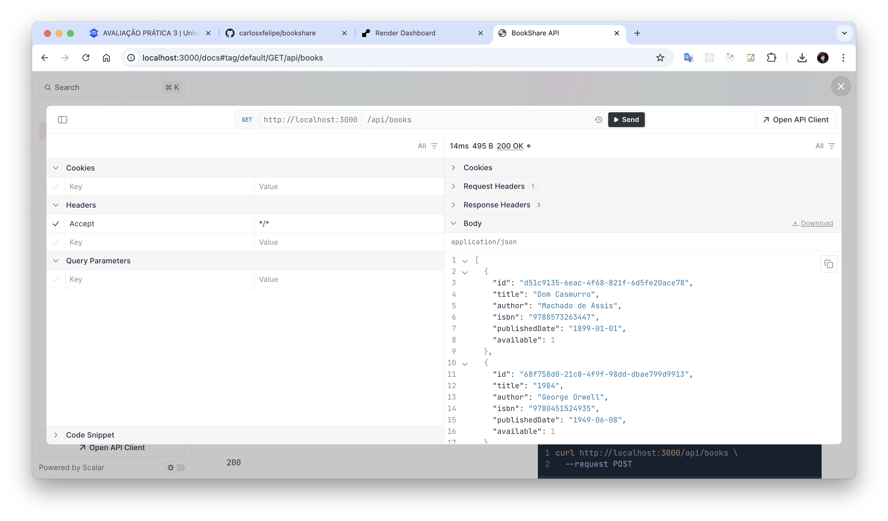

# BookShare

API simples para empréstimo e devolução de livros entre alunos

> A API estará disponível em: [https://bookshare-0olc.onrender.com/docs](https://bookshare-0olc.onrender.com/docs)

Utilizei o plano gratuito do Render, por isso a API entra em modo de espera após 15 minutos sem requisições.

<p align="center">
  
</p>

## Instalação

Clone o projeto e execute:

```bash
bun install
```

## Executando

Para iniciar o servidor:

```bash
bun run app.ts
```

> A documentação Swagger em: [http://localhost:3000/docs](http://localhost:3000/docs)
